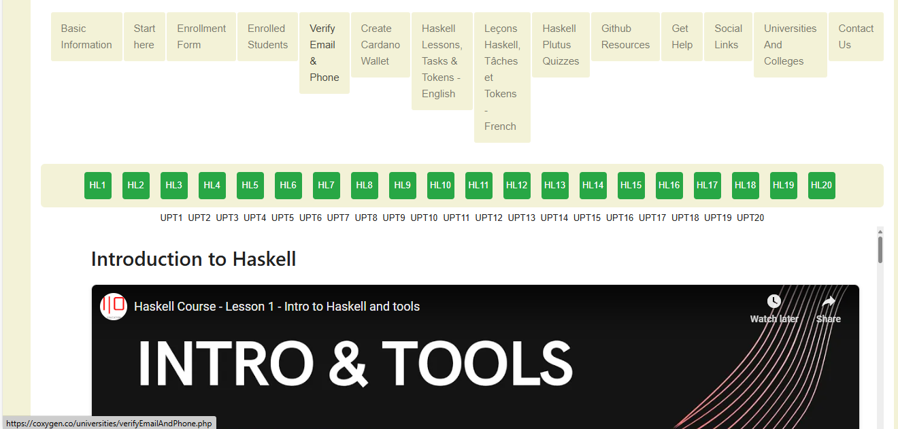
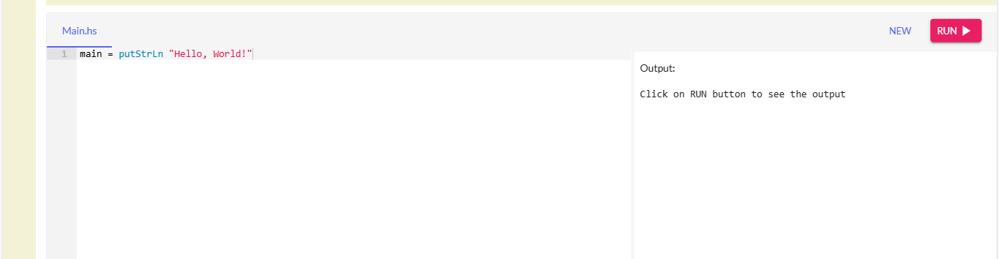
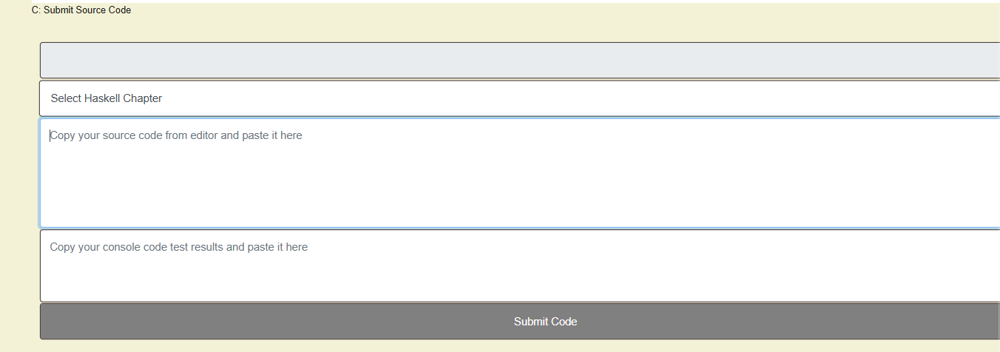

# 🎥 Accessing Video Lessons & Online Compiler

As part of your Haskell Plutus training, you can now access interactive lessons with videos, code compilers, and submission portals in either **English** or **French**.

---

## 🌍 Choose Your Language

Start by selecting the version in your preferred language:

- 🌐 [Haskell Practical Tasks & Progress Tracker – English](https://coxygen.co/universities/haskell-lessons-english.php)
- 🌐 [Haskell Practical Tasks & Progress Tracker – French](https://coxygen.co/universities/haskell-lessons-french.php)

---

## ✅ Lesson Structure

Once you've opened the lesson page, you'll see a list of **green buttons** such as:

- `HL1` – **Haskell Lesson Chapter 1**
- `HL2` – **Haskell Lesson Chapter 2**
- … and so on.

Click on the chapter you want to study.

---

## 🎬 Video Lesson

Each chapter starts with a short, engaging video explaining the key concepts for that chapter.

---

## 🛠️ Practical Task Follows the Video

Immediately after the video, you’ll find the **practical task** section designed to help you apply what you've just learned.

---

## 💻 Haskell Online Compiler

A built-in browser compiler is provided for hands-on learning:

- Type your Haskell code in the editor
- Click **Run** to execute
- Instantly see the output below

No setup required!

---

## 📝 Submitting or Saving Your Code

Once you're done coding and testing:

1. Scroll down to the **submission section**
2. Select your **chapter (e.g., HL1, HL2...)**
3. Paste:
   - Your final **Haskell code**
   - The **output**
4. Click **Submit Code**

✅ This saves your work for progress tracking, mentoring, and verification.

---

## 🆘 Need Help?

Reach out any time if you're stuck or need clarification:

- 📧 [admin@coxygen.co](mailto:admin@coxygen.co)
- 📧 [info@coxygen.co](mailto:info@coxygen.co)
- 🌐 WhatsApp Support: +27 73 182 0631

---
