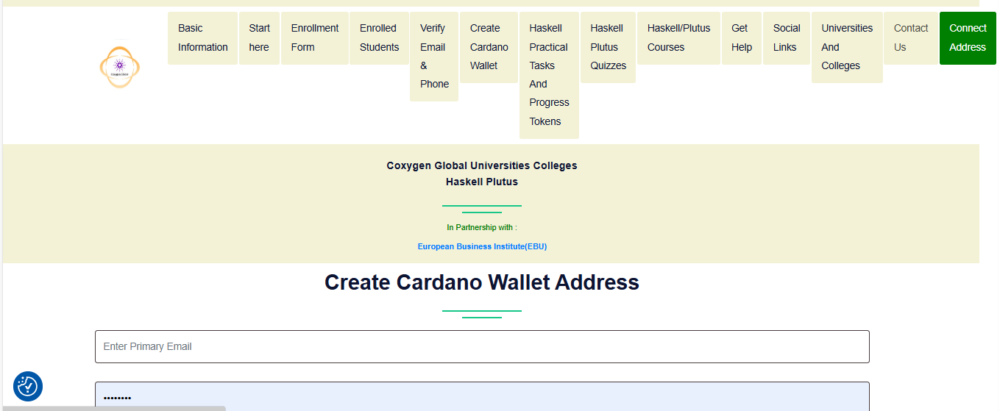

# ✅ Connect Your Wallet & Receive Test ADA

After setting up your Cardano wallet and securing it with a passphrase and PIN, you’ll need to **connect your wallet** to authenticate and begin using blockchain-enabled features in the Coxygen program.

---

## 🔗 Step 1: Connect Your Wallet

1. Open the app or dApp (e.g., Coxygen learning portal).
2. Click the **green “Connect Address”** button.
3. Once connected, you are authenticated and ready to proceed.

> 🎉 Your wallet will come pre-loaded with **a small amount of test ADA** for development use.

---

## 💸 Step 2: Request Additional Test ADA

If you need more test ADA, use the **Cardano Testnet Faucet**:

🔗 [Visit the Testnet Faucet](https://docs.cardano.org/cardano-testnets/tools/faucet)

---

## 🧪 How to Use the Cardano Faucet

Follow these steps carefully:

1. 🧭 Under **Environment**, select:
   - `Preprod Testnet`

2. 📥 At **Action**, select:
   - `Receive TestADA`

3. 🧾 Under **Address (required)**:
   - Enter your **Testnet Wallet Address**  
   *(This address was emailed to you or found in your wallet UI)*

4. ✅ Check the **“I’m not a robot”** box
   - Skip the **API Key** field (you don’t need it)

5. 🚀 Click the **“Request Funds”** button

---

## 💰 Step 3: Check Your Wallet Balance

After requesting funds:

- Wait **a few seconds to 1 minute**
- Then check your wallet balance at:  
  🔍 [https://preprod.cexplorer.io](https://preprod.cexplorer.io)

> Paste your wallet address in the search bar to see your balance and transaction history.

---

## 💡 Tips

- If the faucet says "Too many requests", wait a few minutes and try again.
- You can request test ADA **multiple times** if needed.
- Use test ADA only within the **Preprod testnet** environment — it has no real-world value but is essential for learning and testing.

---

## 📞 Need Help?

- 📧 Email: [admin@coxygen.co](mailto:admin@coxygen.co)
- 📱 WhatsApp Support: +27 73 182 0631

---

