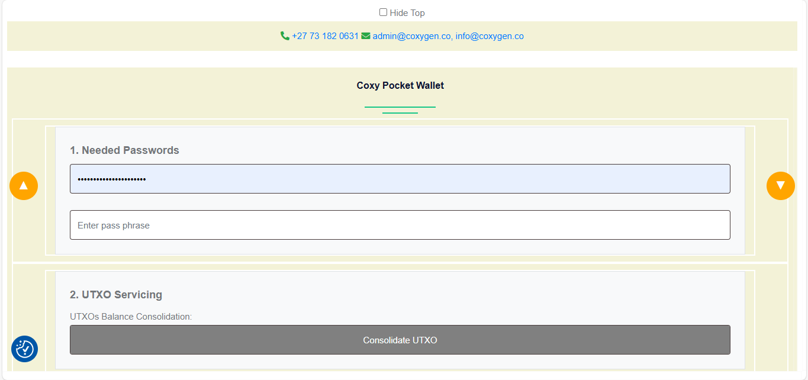

# 👛 Coxy Pocket Wallet User Guide

Coxy Pocket Wallet is your secure Cardano-compatible wallet built into the Coxygen platform. It lets you manage ADA, mint tokens, and back up your keys with ease.

Follow the steps below to use all its features effectively:

---

## 🧭 How to Access the Wallet

To get started:

1. Click on **“Coxy Pocket Wallet”** from the **navigation bar** at the top of the page.
2. You will be taken to the wallet interface.
3. Follow the instructions below to unlock and use each feature.

## 🔐 Step 1: Access the Wallet

To begin using the Coxy Pocket Wallet:

1. **Enter your Passphrase** (secure password used for signing)
2. **Enter your PIN Code** (used for connecting the wallet to dApps and performing transactions)

---

## 🔁 Step 2: UTxO Balance Consolidation

- Click on the **“Consolidate UTxO”** button.

---

## 🪙 Step 3: Mint a Token

1. Enter the **Token Name** (e.g., `HC1T1Proof`)
2. Enter the **Quantity** (e.g., `1`)
3. Click **“Mint Token”**  
   Your token will be recorded on the Cardano testnet blockchain.

---

## 💸 Step 4: Send ADA or Tokens

To send ADA to another wallet address:

1. Enter the **Amount** to send
2. Paste the **Recipient Address**
3. Click **“Send ADA”**

---

## 🧾 Step 5: Backup Your Wallet (Recovery Keys)

To view and back up your **24-word mnemonic seed**:

1. Scroll to the **“Cardano Wallet Keys Backup”** section
2. click on **“Show Your Cardano Wallet Keys Backup”**
3. It will then show your 24 phrases.

> 🔒 Write down your 24 recovery words on paper and store them offline.  
> 🚫 Never store them digitally or share with anyone.

---

## ➕ Step 6: Additional Wallet Addresses

Coxy Wallet allows you to generate **4 additional Cardano wallet addresses**.

- These are used for **receiving payments** and **minted tokens**
- The **first (default)** address is used for **on-chain Haskell progress tracking**
- You can **copy addresses** to your clipboard for sharing or receiving ADA/tokens

---

## 💬 Need Help?

- 📧 Email: [admin@coxygen.co](mailto:admin@coxygen.co)
- 📧 Email: [info@coxygen.co](mailto:info@coxygen.co)
- 📱 WhatsApp Support: **+27 73 182 0631**

---

