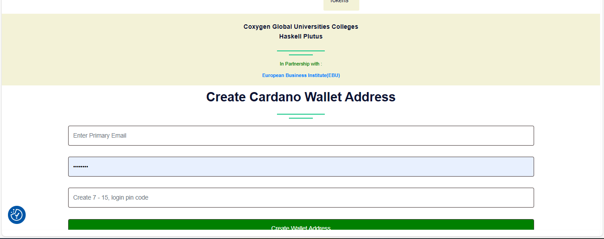

# 🔐 Creating Your Cardano Wallet

Once you’ve completed your **Email & Phone verification**, the next step is to **create your Cardano wallet**. This wallet will store your blockchain credentials and be used for learning, certifications, and smart contract interactions.

---

## 🪪 Why You Need a Wallet

- To **receive on-chain credentials**
- To **interact with Cardano testnet**
- To **store tokens, credentials, and certificates**
- To **connect with dApps and smart contracts**

---

## 🛠️ How to Create Your Wallet

We recommend using a **secure, non-custodial Cardano wallet** such as:

- [Eternl](https://eternl.io)
- [Lace](https://www.lace.io)
- [Flint](https://flint-wallet.com)
- [Nami](https://namiwallet.io)

---

## 🧾 Step 1: Set a Secure Passphrase

When creating the wallet, you will be asked to set a **strong passphrase** to encrypt your **private keys** and **mnemonic seed phrase**.

### ✅ Guidelines:

- Minimum **15 characters**.
- Use a **mix of**:
  - Uppercase letters: `A–Z`
  - Lowercase letters: `a–z`
  - Numbers: `0–9`
  - Symbols: `!@#$%^&*()_+-={}[]|\:;"'<>,.?/~`

> ✍️ **Important**: Write your passphrase down on **paper** and store it **offline** in a safe place.  
> ❗ **Never** store it digitally or share it with anyone — anyone with this passphrase can access all your assets!

---

## 🔐 Step 2: Create a Secure PIN Code

You will also be asked to set a **PIN code** for daily access to your wallet.

### ✅ PIN Guidelines:

- Minimum **6 digits/characters**.
- Combine numbers, uppercase, lowercase, and symbols (if allowed).
- **Make it different from your passphrase!**

> 🔑 Your **PIN** is used for signing transactions and connecting to dApps — treat it like your bank PIN.

---

## ⚠️ Security Reminders

- Do **not use the same** password/passphrase and PIN.
- Do **not share** your mnemonic phrase (12 or 24 words) — **ever**.
- Do **not screenshot** or save passwords/mnemonics on your device or cloud.
- Always **log out** after using your wallet on public devices.

---

## 📦 What You’ll Receive

After creating and securing your wallet, you’ll be able to:

- Receive test tokens or credentials for training
- Interact with **smart contracts**
- Participate in **on-chain exercises**
- Receive **your certification NFTs** and credentials

---

## 💬 Need Help?

If you need assistance setting up your wallet:

- 📧 Email: [admin@coxygen.co](mailto:admin@coxygen.co)
- 📱 WhatsApp: +27 73 182 0631

---

