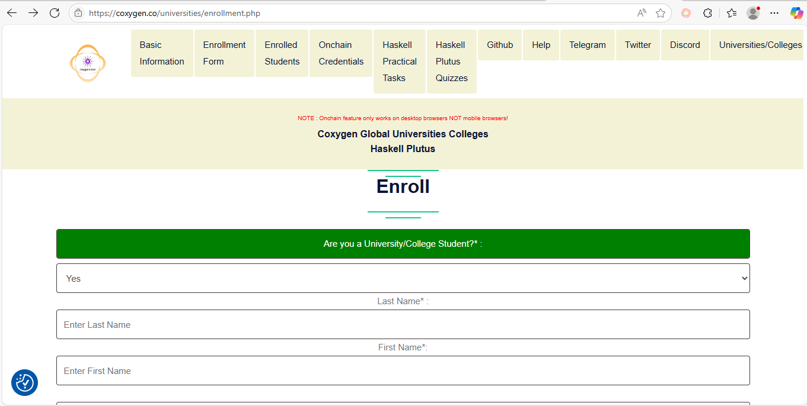
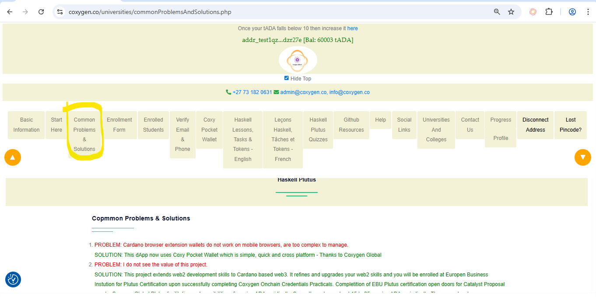

# 🌟 Getting Started with Coxygen Global Universities & Colleges

**Your Gateway to Blockchain Excellence**

Welcome to a groundbreaking opportunity to master **Haskell and Plutus** — the backbone of smart contracts on the Cardano blockchain. This guide walks you through every step of enrolling in the **Coxygen Haskell Plutus Program**, a global initiative designed to upskill and empower future developers.

---

## 🔹 Why Enroll in This Program?

- 🚀 **Career-Boosting Skills**: Learn **Haskell and Plutus**, the smart contract language for Cardano — a highly sought-after skill in blockchain development.
- 🌍 **Global Collaboration**: Join a vibrant network of learners, developers, and professionals from across Africa and around the world.
- 🎓 **Certified Learning**: Earn a certificate of completion and gain recognition in the Cardano ecosystem.
- 🧠 **Expert Mentorship**: Learn directly from experienced facilitators and blockchain developers in the space.

---

## ✅ Step 1: Enroll Now

Start your journey today:  
🔗 [Click to Enroll](https://coxygen.co/universities/enrollment.php)

This link will take you to the official enrollment page where you’ll fill in your personal and academic details.

---

## 📝 Step 2: Fill In Your Enrollment Form

You’ll need the following information:

### 👤 Personal Information

- **First Name**\*: As it appears on your ID or passport  
- **Last Name**\*: Surname or family name  
- **Gender**\*: Select from Male, Female.  
- **ID Number**\*: National ID.

### 🎓 Academic Background

- **Qualification**\*: Your highest level of education (e.g., Diploma, BSc, BTech, etc.)  
- **Institution**\*: Name of your university or college  
- **Institution Address**\*: Full address (street, city, province, postal code)  
- **Student Number**\*: Your institution-assigned student number

### 📱 Contact Details

- **Mobile Number**\*: **All mobile numbers must be in international format** — e.g., `+27xxxxxxxxx`  
- **Primary Email**\*: Your main email address (used for system communication) and it must be working, correct and alternative accessible.  
- **Secondary Email**\*: This must be a **working, correct, and accessible** email address  
- **Home Address**\*: Full residential address for verification purposes

### 💬 Communication Channels

- **Telegram Username**\*: Required to access update channels and receive notifications  
- **Discord Username**\*: Used for workshops, voice discussions, and developer communities

### 📚 Additional Information

- List any blockchain-related groups, chats, or forums you've joined (one per line)  
- Include full URLs or usernames if applicable

> 🛡️ **Privacy Note**: All submitted information is confidential, securely stored and will be used exclusively for WIMS & coxygen Cardanos  and program-related purposes.

---

## 📤 Step 3: Submit Your Enrollment

Before submitting:

- ✅ Review all entries — especially your contact information  
- ✅ Ensure your Telegram and Discord usernames are correct  
- ✅ Click the **Enroll** button at the bottom of the form

---

## 💻 What Comes Next?

After successful enrollment:

- ✅ **Verify your email and phone number** — codes will be sent for confirmation.
- **create wallet(Coxy Pocket Wallet)**   
- 📚 **connect Address and do lessons** from Haskell Chapter 1 through Chapter 20  
- **For more information go to common problems & solutions.**

---

## 💬 Need Help?

If you need support at any stage:

- 📧 Email: [admin@coxygen.co](mailto:admin@coxygen.co) | [info@coxygen.co](mailto:info@coxygen.co)  
- 🌐 WhatsApp Support: +27 73 182 0631

---

