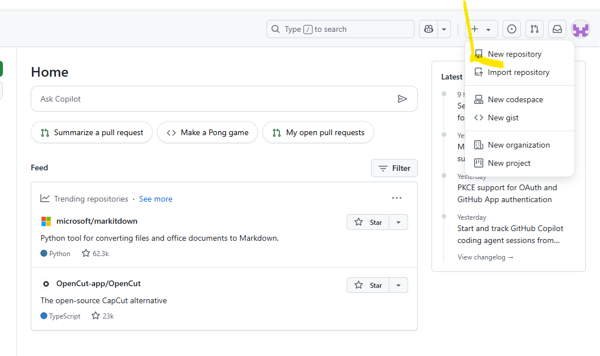
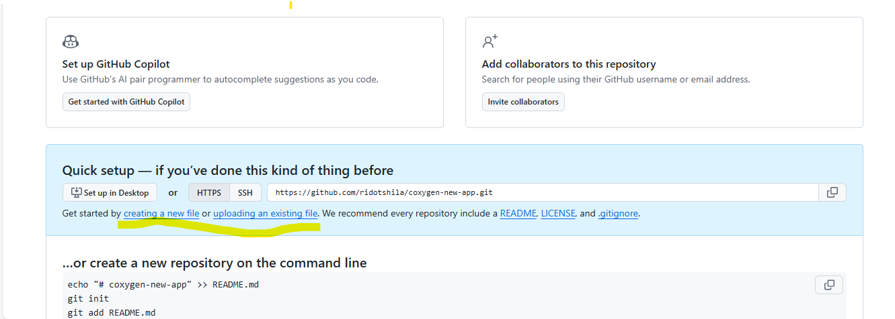

# 🧰 GitHub Submission Guide (For Beginners)

Welcome! This guide will help you upload your Haskell Plutus practical tasks to GitHub — no coding or terminal required.

---

## 🌐 Step 1: Create a GitHub Account

1. Go to [https://github.com](https://github.com)
2. Click **Sign up**
3. Fill in your details and follow the steps to verify your email

---

## 📁 Step 2: Create a New Repository

1. After signing in, click the **+ icon** in the top right
2. Choose **New repository**
3. Fill in the form:
   - **Repository name**: `haskell-plutus-practicals` (or similar)
   - **Description**: Example — “Solutions to Haskell Plutus Tasks from Coxygen”
   - Select **Public**
   - ✅ Check **“Add a README file”**
   - ✅ Choose **MIT License**

4. Click **Create repository**

---

## ⬆️ Step 3: Upload Your Task Files

1. In your new repository, click **Add file > Upload files**
2. Drag or select your `.hs` files (e.g., `HC1T1.hs`, `HC2T2.hs`, etc.)
3. Scroll down and click **Commit changes**

Repeat this for all your completed tasks.

---

## 📝 Step 4: Edit the README.md

1. On your repo’s homepage, click `README.md`
2. Click the **pencil icon** to edit
3. After editing Scroll down and click Commit changes.

 ## ✅ Step 5: Double Check Your Repository

Make sure your repository includes:

- ✅ Your `.hs` files (e.g., `HC1T1.hs`, `HC1T2.hs`, etc.)
- ✅ A clear and professional `README.md`
- ✅ An open-source **MIT License**

---

## 📤 Step 6: Share Your GitHub Link

After completing your uploads:

- Copy the **URL** of your repository  
  _(Example: `https://github.com/yourusername/haskell-plutus-practicals`)_

- Save this link — you may be required to submit it for verification or portfolio review.

---

## 🆘 Need Help?

- 📧[admin@coxygen.co](mailto:admin@coxygen.co)  
- 📧[info@coxygen.co](mailto:info@coxygen.co)

- 💬 **WhatsApp Support**: +27 73 182 0631

---

