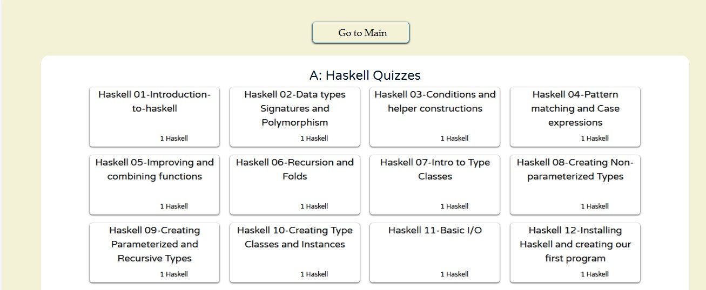

# 📝 Completing the Haskell Plutus Quizzes

After you've successfully enrolled and verified your **Email & Phone**, your next step in the **Coxygen Haskell Plutus Program** is to complete the **required quizzes**.

These quizzes assess your understanding of both **theoretical concepts** and **practical applications** of **Haskell** and **Plutus**.

---

## 🚀 Step 1: Navigate to the Quiz Page

Access the official quiz platform here:

🔗 [Haskell Plutus Quizzes Page](https://coxygen.co/universities-test/quiz/)

Or click the **“Haskell Plutus Quizzes”** link in the website’s top navigation menu.

---

## 🧠 Step 2: Complete All 17 Quizzes

You are required to complete **17 quizzes** in **sequential order**:

1. Start with **Haskell Quiz 1**
2. Progress through to **Haskell Quiz 17**

### 📚 Quiz Types Include:

- ✅ **Multiple-choice questions (MCQs)**
- ✅ **Code-based assessments**
- ✅ **Conceptual logic challenges**

> ⚠️ **Important**: You can **only attempt each quiz once**. No retries are allowed — so focus carefully.

---

### 📖 Tips for Success

- Read **each question** and **instruction** thoroughly.
- Take your time and think critically before selecting answers.
- Avoid rushing — **there are no second chances per quiz**.

---

## 📤 Step 3: Submitting the Quizzes

After you complete each quiz:

- ✅ Your answers are **automatically recorded**.
- 🚫 **No changes or edits** are allowed after submission.
- 💾 Each quiz submission is **final**.

---

## 📸 Step 4: Capture Your Quiz Token Certificate

Once you complete a quiz (or set of quizzes), you may receive a **Bedge Certificate** — a digital badge verifying your participation.

### 🔍 What to Do:

- 📸 Take a **clear screenshot** of your **Token Certificate** after completion.
- 💾 Save the screenshot on your device and **label it clearly** (e.g., `QuizToken1.png`).

---

## 📦 Step 5: Include in Your Final Submission

When submitting your practical tasks:

- ✅ **Upload all task screenshots** (e.g., HC1T1.png, HC1T2.png, etc.)
- ✅ **Include your Token Certificate screenshots** along with the tasks.
- 📤 Submit everything via the submission page (e.g., `PC1`, `PC2` buttons)

> 🧠 This helps verify that you completed **both the practical and quiz components** of the program.

---

## 🆘 Need Help?

If you encounter any issues such as missing quizzes, technical errors, or submission problems:

- 📧 Email:  
  - [admin@coxygen.co](mailto:admin@coxygen.co)  
  - [info@coxygen.co](mailto:info@coxygen.co)  
- 🌐 WhatsApp Support: +27 73 182 0631

> ✅ Support is available to help you troubleshoot and stay on track.

---

## 🎯 Final Note

> 💡 "Quizzes are more than just tests — they reinforce your understanding and prepare you for real-world development."

Stay focused, take each quiz seriously, and you'll be well on your way to becoming a confident Cardano smart contract developer!

---
