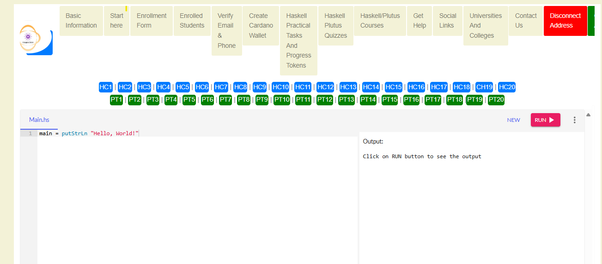

# 🧪 Completing the Haskell Plutus Tasks

Welcome to the most exciting part of your learning journey!

**Mastering Haskell and Plutus requires hands-on practice** — and that's exactly what these tasks are built for.

> 🚀 _"No shortcuts. No skipping. Just skill-building."_

---

## 🗺️ Step 1: Navigate to the Task Page

Start by accessing the official task page here:

🔗 [Haskell Plutus Tasks Page](https://coxygen.co/universities-test/haskell.php)

Or use the **“Haskell Plutus Tasks”** option in the top navigation bar of the [Coxygen website](https://coxygen.co/universities-test).

---

## 📚 Step 2: Understand the Tasks

Each task is carefully designed to help you:

- ✅ Grasp **Haskell fundamentals**: functional programming, pattern matching, types, etc.
- ✅ Learn **Plutus** smart contract logic (on-chain and off-chain)
- ✅ Write, test, and deploy Cardano smart contracts
- ✅ Solve real-world blockchain problems

> ⚠️ **Important**: Skipping tasks or rushing may lead to gaps in understanding, especially for advanced Plutus topics.

---

## 🛠️ Step 3: Completing the Tasks

To succeed in the program and gain proper verification:

1. ✅ **Start with Task 1** and follow the tasks in sequence.
2. 📖 **Read the instructions** on each task page thoroughly.
3. 🧠 **Understand the objective** of each task before starting.
4. ✍️ **Complete tasks carefully**, which may involve:
   - Writing **Haskell or Plutus code**
   - Explaining theoretical ideas
   - Deploying and testing contracts (on-chain/off-chain)

---

## 📸 Step 4: Screenshot Every Completed Task

You are required to take a screenshot of every completed task as **proof of work**.

### 📷 Your screenshot must show:

- ✅ The **task number and title** (e.g., HC1T1)
- ✅ Your **code or written solution**
- ✅ Any **output, results, or successful test**

💾 Save each screenshot on your computer.  
📂 Organize them by task, e.g.: HC1T1.png, HC1T2.png, HC1T3.png

> 💡 Tip: Make sure your screenshots are **readable and labeled clearly** to help reviewers verify them easily.

---

## 💾 Step 5: Save Your Code Online (Optional but Recommended)

You can also save your solutions directly on the Coxygen site:

1. 🖱️ **Scroll down** to the bottom of the [Haskell Tasks Page](https://coxygen.co/universities-test/haskell.php)
2. 📘 **Choose the Chapter** you are working on (e.g., Chapter 1)
3. ⌨️ **Paste your code** in the **Code box**
4. 🧾 **Paste your output** in the **Output box**
5. ✅ Click **“Submit Code”** to save it to your student profile

---

## 🟢 Step 6: Submit Your Work (With Screenshots)

Once you've completed tasks and saved screenshots:

1. Click the green submit button (e.g., `PC1`, `PC2`, etc.)
2. You’ll be redirected to a secure submission form
3. Fill in your:
   - 🔐 **Passphrase**
   - 🔢 **PIN code**
4. Click **“Choose Files”** and upload your **task screenshots**
5. Finally, click **“Upload”**
6. Then click **“Mint Token”** to record your submission on-chain!

> 🪙 This minting acts as **proof of completion** and may reward you with **digital credentials or tokens**.

---

## 🆘 Need Help?

You’re not alone — support is always available:

- 📧 Email:
  - [admin@coxygen.co](mailto:admin@coxygen.co)
  - [info@coxygen.co](mailto:info@coxygen.co)
- 🌐 WhatsApp Support: +27 73 182 0631
- 💬 Developer Community:  
  Join our **Telegram** or **Discord** channels (coming soon) to connect with mentors and fellow learners.

---

## 🎯 Pro Tip

> 💡 **Mastery comes from doing — not just reading.**

Give each task your **best effort**, ask questions, and take your time. Completing these exercises will give you the confidence and skills to become a **proficient blockchain developer on Cardano**.

---

