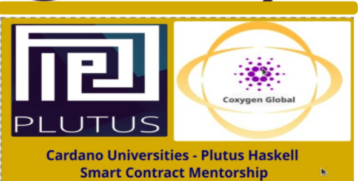

  

# 👋 Welcome to the Coxygen Haskell Plutus Program

**Author**: *Ridotshila Mambeda*  
**Last Updated**: July 7, 2025

---

Welcome to the official learning guide for the **Coxygen Global Haskell & Plutus Program** — your first step toward mastering smart contract development on the Cardano blockchain.

This interactive learning platform will walk you through:

✅ Program enrollment and verification  
✅ Setting up a secure Cardano wallet  
✅ Navigating beginner-friendly Haskell and Plutus lessons  
✅ Completing tasks, quizzes, and submitting proofs of work  
✅ Minting your blockchain credentials and tokens

> 🎓 Whether you're a student, developer, or blockchain enthusiast, this course is built to empower your journey — one lesson at a time.

---

## 📘 How to Use This Guide

- Use the sidebar to navigate chapters in order.
- Follow the tasks step-by-step.
- Don't skip any lessons — each is designed to build your skills progressively.
- Take screenshots, save your code, and submit your work properly.

---

## 💬 Need Help?

If you need assistance setting up your wallet:

- 📧 Email: [admin@coxygen.co](mailto:admin@coxygen.co)
- 📱 WhatsApp: +27 73 182 0631

---

