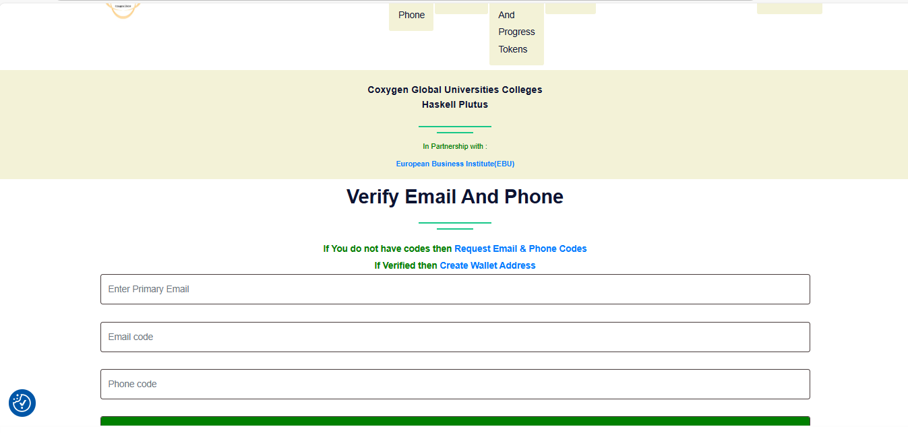

# 🔐 Email & Phone Verification Guide

To ensure secure access and successful participation in the **Coxygen Haskell Plutus Program**, verifying your **Email** and **Phone number** is **mandatory**.

---

## 🆕 For New Students (After Enrollment)

After submitting your enrollment form:

1. ✅ **Check for Verification Codes**
   - You will receive **two codes**:
     - 📧 One via **Email**
     - 📱 One via **SMS** on your phone number

2. 🔍 **Check Your Email Inbox**
   - Be sure to **check your Spam or Promotions folder**, especially if you’re using Gmail.
   - The email contains your **Email verification code**.

3. 📲 **Check Your SMS Messages**
   - You’ll receive a **Phone verification code** via SMS on the number you registered.

4. 🔐 **Verify Your Email & Phone**

   - Go to: [https://coxygen.co/universities/verifyEmailAndPhone.php](https://coxygen.co/universities/verifyEmailAndPhone.php)
   - Enter your **primary email**
   - Enter the **email code** and **phone code**
   - Click **“Verify Email and Phone Code”**

---

## 🔁 For Already Enrolled Students (Who Missed or Lost Codes)

If you’ve already enrolled but didn’t verify or lost your codes:

1. 🔄 **Request New Verification Codes**
   - Go to: [https://coxygen.co/universities/requestEmailAndPhoneCodes.php](https://coxygen.co/universities/requestEmailAndPhoneCodes.php)
   - Enter your **primary email** and **phone number**
   - Click **“Request Email & Phone Code”**

2. 📬 **Check Your Inbox and SMS**
   - Look for a new **email verification code** (check spam too)
   - Wait for a new **SMS code** on your phone

3. ✅ **Verify**
   - Once you receive both codes, return to:
     - [https://coxygen.co/universities/verifyEmailAndPhone.php](https://coxygen.co/universities/verifyEmailAndPhone.php)
   - Enter your **email** and both codes
   - Click **“Verify Email and Phone Code”**

---

## ℹ️ Why This Is Important

✅ Verifying your contact details enables:

- Program updates and announcements  
- Access to Telegram & Discord groups  
- Participation in quizzes and workshops  
- Eligibility for certificates and on-chain credentials

---

## 💬 Need Help?

If you need assistance setting up your wallet:

- 📧 Email: [admin@coxygen.co](mailto:admin@coxygen.co)
- 📱 WhatsApp: +27 73 182 0631

---

